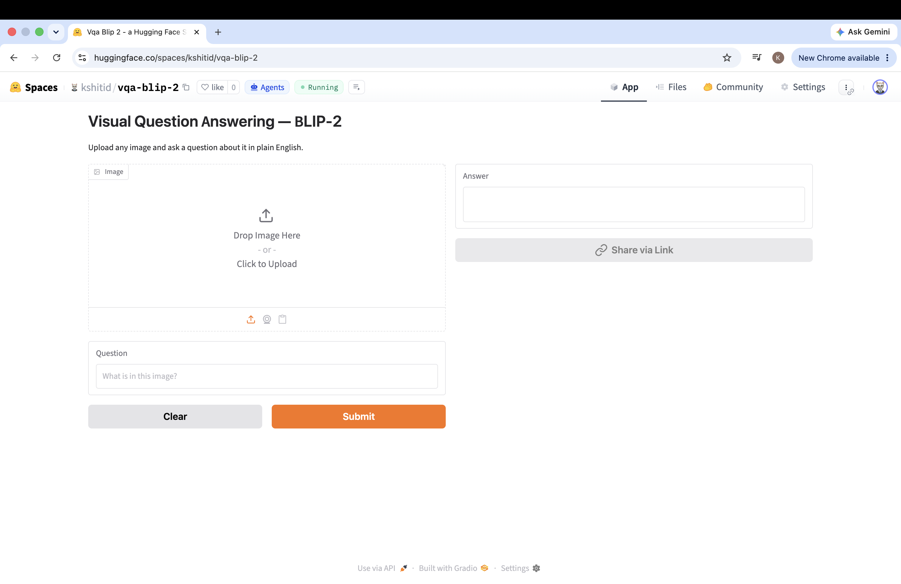
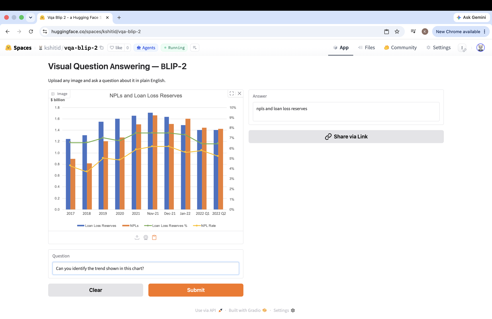

# Visual Question Answering with BLIP-2

Upload any image, ask a question in plain English, get an answer.

🔗 **Live demo:** https://huggingface.co/spaces/kshitid/vqa-blip-2

---

## Demo



| Image | Question | Answer |
|---|---|---|
|  | Which breed of dog is this? | beagle |
|  | Can you identify the trend shown in this chart? | npls and loan loss reserves |

---

## How it works

BLIP-2 connects a frozen ViT vision encoder to an OPT-2.7B language model through a Q-Former — a lightweight transformer that queries the most task-relevant visual features before passing them to the LLM. This lets the model ground its answers in what it actually sees rather than hallucinating from language patterns alone.

The prompt is structured as `Question: {input} Answer:` to trigger the model's instruction-following behavior, with the echoed prompt stripped from the output before returning the answer.

---

## Stack

- **Model:** [Salesforce/blip2-opt-2.7b](https://huggingface.co/Salesforce/blip2-opt-2.7b)
- **Interface:** Gradio
- **Hosting:** Hugging Face Spaces (CPU)

---

## Run locally

```bash
git clone https://github.com/kshitideshpande/vqa-blip2
cd vqa-blip2
python -m venv venv && source venv/bin/activate
pip install -r requirements.txt
python app.py
```

First run downloads the model (~15GB). Cached after that. Inference runs on CPU — expect 30–60s per query.

---

## Limitations

- Answers are short by design — BLIP-2 is a VQA model, not a captioning model
- Running on CPU, so inference is slow compared to a GPU deployment
- Works best with clear, well-lit images and specific questions
